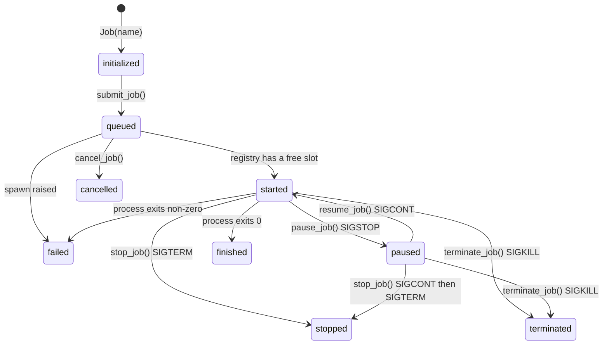

# carpenter

A Python job registry built on top of threading and subprocesses.

Think of it as an ant hill: need something done, send an ant!

```
 \ \
  \ \
   (o)=(#)=(___)
       /|\
      / | \
```

Carpenter supervises external processes. You describe a command once as a **Blueprint**, wrap each run of it in a **Job**, and hand those jobs to a **Registry** that decides when to start them, reaps them, collects their output, and decides when there is nothing left to supervise.

Carpenter uses only the Python standard library. It does not require a broker, a daemon, or a database.

## Requirements

- Python 3.8+ (developed on 3.14)
- Linux/macOS for the full feature set; see [Platform notes](#platform-notes) for Windows

## Install

Carpenter is not on PyPI yet, but it is a normal pip installable package. Install it into any venv straight from GitHub:

```bash
pip install git+https://github.com/Power-Sh3ll/carpenter.git
```

Or from a clone on disk, using `-e` if you want your edits in the clone to show up live in the project that depends on it:

```bash
pip install /path/to/carpenter
pip install -e /path/to/carpenter
```

Either way, the import is the same:

```python
from carpenter import Blueprint, Job, Registry
```

To build a wheel:

```bash
pip install build
python -m build
pip install dist/carpenter-0.1.0-py3-none-any.whl
```

To see it working before committing to anything, clone the repo and run the demo. It needs nothing installed and takes about fifteen seconds:

```bash
git clone https://github.com/Power-Sh3ll/carpenter.git
cd carpenter
python examples/demo_scheduling.py
```

It walks through admission control, FIFO against LIFO, priority weights, aging, and what happens to a job whose command does not exist. To work on carpenter itself:

```bash
pip install -e ".[dev]"
python -m pytest
```

## The classes

| Class | Purpose |
| --- | --- |
| `Blueprint` | A reusable process template: command, working directory, environment. Every `spawn()` launches a fresh, independent process, so one blueprint can back any number of jobs. |
| `Job` | One run of a blueprint. Carries its own name, status, timings, exit code, and captured output. Submitted to a registry, which starts it when there is room. |
| `Registry` | The supervisor. Owns the jobs, decides which ones run, starts and stops them, drains their pipes on background threads, reaps them as they exit, and applies a shutdown policy. |
| `Settings` | One registry's configuration. Optional: a plain dict works everywhere a `Settings` does, and is easier to load from a config file. |

## Quick start

*See [Driving the Loop yourself](#driving-the-loop-yourself) for a more interactive example.*

```python
from carpenter import Blueprint, Job, Registry

settings = {
    "terminate_behavior": "on_idle",   # come down once nothing is running
    "idle_time": 0,                    # ...immediately after the last job finishes
    "keep_jobs": True,                 # keep finished jobs around to inspect
}

blueprint = Blueprint(["python", "-u", "task.py"])

with Registry(settings, default_blueprint=blueprint) as reg:
    for i in range(3):
        reg.submit_job(Job(f"job_{i}"))

    reg.wait_for_jobs()
    reg.print_registry()
```

```
------------------------------------------------------------------------------------------
Job ID                               Name                 Status     Runtime    Exit Code
------------------------------------------------------------------------------------------
a723d7f4-8dc9-44cf-bbc9-4437b9e26ac2 job_0                failed     22.0s      1
3aba6ec7-6a87-4736-82d4-21327f06eb33 job_1                finished   19.0s      0
079f758b-4a96-4831-8b09-18f7e1f8420a job_2                finished   16.0s      0
------------------------------------------------------------------------------------------
3 jobs | 0 active | runtime 22.0s | idle 0.0s / 0s | SHUT DOWN
------------------------------------------------------------------------------------------
```

(`job_0` failed because `task.py` deliberately raises if it takes more than 20 seconds. The registry reports that; it does not treat it as its own error. And `SHUT DOWN` is already showing because with `idle_time: 0` the monitor comes down the moment the last job exits, possibly before you have finished printing. Give it a second or two if you want to inspect a still-live registry.)

Leaving the `with` block applies the shutdown policy rather than overriding it: under `on_idle` it waits out the registry's own idle window, under `manual` it drains the jobs and comes down. An exception skips both and tears everything down immediately.

Jobs can also arrive over time rather than all at once. A registry with `terminate_behavior: "on_idle"` treats a late arrival as a reset of its idle countdown, so a long-lived script can keep feeding work in from a background thread without the registry deciding it is finished in between.

## Limiting what runs at once

`submit_job()` hands a job to the registry. It does not promise to start it. With `max_jobs` set, the registry runs that many at a time and everything else waits its turn:

```python
settings = {"max_jobs": 2, "keep_jobs": True}

with Registry(settings, default_blueprint=blueprint) as reg:
    jobs = [reg.submit_job(Job(f"job_{i}")) for i in range(5)]

    print([job.status for job in jobs])
    # ['started', 'started', 'queued', 'queued', 'queued']

    reg.wait_for_jobs()   # waits for the whole backlog, not just the running two
```

The registry starts the next queued job the moment a slot comes free, in the order the jobs were submitted. Nothing is dropped and nothing needs to be retried by the caller.

Without `max_jobs` the registry starts everything on arrival, which is how it behaves by default.

Because the registry decides when to spawn, a job's process does not necessarily exist when `submit_job()` returns:

```python
job = reg.submit_job(Job("job"))
job.process.pid          # AttributeError if the job is still queued
job.status               # "started" or "queued", always safe to read
```

A job that is still waiting can be withdrawn with `cancel_job()`. It never ran, so no signal is sent and there is no grace period. `stop_job()` and `terminate_job()` are for jobs that have actually started, and say so if you call them on a queued job.

```python
for job in reg.queued_jobs():
    reg.cancel_job(job)
```

Handing over far more work than the registry can run at once is the expected way to use this. Nothing is dropped, nothing needs retrying, and the registry meters it out as slots come free. `python examples/demo_scheduling.py` shows ten jobs going into a registry that runs three.

## Choosing what runs next

Once jobs are queuing, something has to decide which one goes first. Two settings control it, and they are independent, so all four pairings mean something.

`dispatch_order` picks between a queue and a stack:

```python
{"dispatch_order": "fifo"}   # default. Longest waiting job starts next.
{"dispatch_order": "lifo"}   # Most recently submitted job starts next and the prior is paused.
```

FIFO is what submitted work usually wants: results arrive in the order they were asked for. LIFO suits work whose newest request is its most relevant one, such as generating a thumbnail for whatever the user is looking at right now, where a backlog of older requests has usually been scrolled past.

`priority_processing` decides whether weights are consulted at all:

```python
reg = Registry({"max_jobs": 1, "priority_processing": True}, blueprint)

reg.submit_job(Job("nightly_report", priority=-10))
reg.submit_job(Job("thumbnail", priority=0))
reg.submit_job(Job("user_is_waiting", priority=100))

[job.name for job in reg.queued_jobs()]
# ['user_is_waiting', 'thumbnail', 'nightly_report']
```

Higher priority starts sooner, negative values sink below the default of zero, and `dispatch_order` breaks ties between equal weights. With `priority_processing` off, `job.priority` is ignored completely rather than quietly half working.

A priority can be changed while a job is queued, and it takes effect on the next dispatch.

**A weight decides which job starts, not which finishes.** A priority 100 job that runs for an hour still finishes after a priority 1 job submitted later that takes a second. Carpenter never interrupts a running job to make room for a more important one.

`queued_jobs()` returns the waiting jobs in the order they will actually start, so it is the direct answer to "what is the registry going to do next".

### Aging

A LIFO queue under steady load never reaches its oldest job, and a steady stream of high priority work starves everything below it. Aging fixes both: a job that has been waiting gains priority.

```python
{"aging": True, "age_step": 30, "age_max": 4}
```

That reads as: every 30 seconds a job spends waiting, it gains one level of priority, up to 4 levels. A job's effective priority is therefore its own weight plus what it has earned by waiting, which you can read directly:

```python
reg.effective_priority(job)
```

Two things about this are deliberate.

**The gain is in whole steps rather than climbing smoothly.** A boost that rose continuously would give the longest waiting job a strictly higher number at every instant, which orders the queue by age alone and quietly turns `lifo` into `fifo` the moment aging is switched on. Whole steps leave jobs inside the same step to be ordered by `dispatch_order` as normal, so LIFO keeps behaving like LIFO until something has genuinely waited too long.

**`age_max` matters more than it looks.** Without a ceiling, a job that has waited long enough eventually outranks everything, including urgent work that has only just arrived, which trades a starvation problem for a priority inversion problem. The cap keeps aging as a fairness floor rather than a second scheduler.

Aging works with `priority_processing` off as well as on. Starvation is a property of the LIFO ordering itself, not of using weights, so `{"dispatch_order": "lifo", "aging": True}` is a complete and sensible configuration on its own.

## Lanes

An application usually runs more than one kind of work, and one kind should not be able to crowd out another. A video editor generating thumbnails must never find that a burst of thumbnail requests has taken every slot away from a render the user is waiting on.

Mounting one registry inside another gives each kind of work its own limit and its own ordering, under a shared ceiling:

```python
app = Registry({"max_jobs": 4, "keep_jobs": True}, default_blueprint=blueprint, name="app")

thumbnails = app.mount(Registry({"max_jobs": 1, "dispatch_order": "lifo"}, name="thumbnails"))
renders    = app.mount(Registry({"max_jobs": 3, "priority_processing": True}, name="renders"))

thumbnails.submit_job(Job("thumb_0"))
renders.submit_job(Job("render_0", priority=50))
```

The thumbnail lane runs newest first and never uses more than one slot. The render lane runs by weight and has three. Neither can reach the other's capacity, because capacity is partitioned rather than shared: the lane limits are checked at mount time to add up to no more than the parent's, so a lane that respects its own limit cannot push the tree past the ceiling.

A registry holds jobs **or** other registries, never both. One holding jobs is a lane and does the supervising; one holding registries governs them. Submitting a job to a registry that holds lanes raises, and so does mounting a lane into one that holds jobs.

### What a lane inherits

A lane keeps every setting it named for itself and inherits the rest from the registry it is mounted in, including the default blueprint:

```python
thumbnails.max_jobs         # 1, its own
thumbnails.dispatch_order   # "lifo", its own
thumbnails.keep_jobs        # True, inherited from app
```

This is the reason `Settings` exists rather than a plain dict. A lane that says `keep_jobs=False` has expressed an opinion, and it has to survive a parent saying `True`. A dict cannot tell that apart from a lane that simply never mentioned the key, because both read the same way through `.get()`.

A lane that names no `max_jobs` inherits its parent's, so it can claim the whole allowance and a second such lane will be refused.

### One lifecycle

This is what nesting buys that two separate registries cannot. The whole tree is driven by a single monitor thread belonging to the registry at the top, has one idle clock, and comes down with one call:

```python
app.shutdown()
```

Lanes are brought down before the registry governing them, so nothing is still spawning while its governor is being torn down. Each lane's own `on_shutdown` fires as it goes, and the top one's fires last.

`print_registry()` on the tree prints one table per lane and a line for the whole thing, which is the single view across every lane that three separate registries could not give you.

### Reading the tree

Brackets read, methods write. Reading is cheap and pure, so it gets subscripting; mounting reserves capacity and validates against a ceiling, and unmounting sends signals and waits out a grace period, so those get verbs.

```python
app["renders"]                  # the lane
app["renders"]["render_0"]      # a job in it
"renders" in app
len(app)                        # lanes, or jobs on a lane
[lane.name for lane in app]     # iteration yields lanes, or jobs on a lane

app.unmount("renders", grace=30)
```

`app[...]` raises `KeyError` when there is no match, which is the container contract. `get_job()` stays as the softer form that returns `None`, and searches every lane.

There is no ordering between lanes. They hold separate capacity and do not compete, so `queued_jobs()` on the tree is each lane's queue concatenated, each in its own order.

## Job names

A job name must be a non-empty, lowercase, valid Python identifier under 256 characters. In practice: letters, digits and underscores, not starting with a digit, no capitals.

| Name | Result |
| --- | --- |
| `job_0` | Fine |
| `Job_0` | `ValueError`, capital letter |
| `Job #0` | `ValueError`, space and `#` are not identifier characters |
| `job-0` | `ValueError`, hyphen is not an identifier character |
| `0_job` | `ValueError`, cannot start with a digit |

The usual way to trip over this is an f-string written for display rather than for lookup:

```python
job = Job(f"Job #{i}")   # ValueError
job = Job(f"job_{i}")    # fine
```

The name is not only a label. `get_job(name=...)` looks jobs up by it, and under `output_mode="file"` it becomes part of the log filename, so keeping it identifier shaped keeps both of those predictable.

## Driving the loop yourself

`wait_for_jobs()` blocks until everything has drained, which is all a one-shot script needs. When you want to watch progress as it happens, or do your own work between sweeps, you write the loop instead. This is the shape:

```python
import time
from carpenter import Blueprint, Job, Registry

settings = {
    "terminate_behavior": "on_idle",   # come down once nothing is running
    "idle_time": 0,                    # immediately after the last job finishes
    "keep_jobs": True,                 # keep finished jobs around to inspect
}

script = """
import random
import time
sleep_time = random.randint(1, 5)

for x in range(1, 6):
    print(f"Job {x} is running...")
    time.sleep(sleep_time)
    print(f"Job {x} completed after {sleep_time} seconds.")
"""

# Meanings:
# python: the interpreter to use for executing the script
# -u    : unbuffered output
# -c    : run the script passed as a string
# script: the script to execute
# task.py: an alternative to using the script string, you can also point to a file

blueprint = Blueprint(["python", "-u", "-c", script]) 
# blueprint = Blueprint(["python", "-u", "task.py"]) # alternative to using the script string, you can also point to a file

with Registry(settings, default_blueprint=blueprint) as reg:
    # Create 3 jobs with the default blueprint and submit them to the registry
    for i in range(3):
        reg.submit_job(Job(f"job_{i}"))

    while not reg.is_shutdown: # only use this if you want to loop the print until the registry is shutdown
        reg.poll_jobs()
        active = reg.active_jobs() # returns True if any jobs are still running
        reg.print_registry(clear=True)
        if not active and reg.terminate_behavior == "manual":
            break
        time.sleep(max(1, reg.poll_interval)) # poll interval present to avoid busy waiting, but also ensure that the loop doesn't run too frequently 
```

Four things in there are worth spelling out, because none of them are guessable.

**`while not reg.is_shutdown` only ends on its own under `on_idle`.** `should_terminate()` returns `False` immediately for a `manual` registry, so the monitor never brings it down and the condition stays true forever. That is what the explicit `break` is for: under `manual`, a drained registry is the loop's own stopping point, because nothing else is ever going to say so.

**Your `poll_jobs()` call is not what reaps the jobs.** The monitor thread is already sweeping every `poll_interval`, started for you by the first `submit_job()`. Calling it here means the table you are about to print reflects this instant rather than whatever the last background sweep saw. It also starts any queued job that the sweep just made room for, and returns the jobs that finished on this sweep, which is the hook to use if you want to react to completions instead of only displaying them.

**`print_registry(clear=True)` homes the cursor before drawing**, so the table redraws in place instead of scrolling. Anything printed earlier in the loop is wiped by the redraw. The clear is skipped when stdout is not a TTY, so piping to a file gives you the tables one after another rather than a screen-clear before each. Note that the per-row status colors are written either way, so piped output still contains color escapes.

**Sleep at least `poll_interval`.** Nothing in the registry can change faster than the monitor polls, so a tighter loop reprints the same table and burns CPU for nothing.

## Settings

Everything is a key in the dict passed to `Registry(settings)`. All are optional; all are validated on construction, so a bad setting raises `ValueError` immediately rather than mid run. A misspelled key is rejected rather than ignored, so `Registry({"idel_time": 5})` tells you about the typo instead of quietly giving you a registry that never shuts down.

The same settings can be given as a `Settings` object, which is the form the registry stores internally:

```python
from carpenter import Registry, Settings

Registry(Settings(max_jobs=4, keep_jobs=True))
Registry({"max_jobs": 4, "keep_jobs": True})     # identical
```

| Key | Type | Default | Meaning |
| --- | --- | --- | --- |
| `max_jobs` | int ≥ 1, or `None` | `None` | How many jobs may run at once. `None` means no limit, so everything starts on arrival. See [Limiting what runs at once](#limiting-what-runs-at-once). |
| `dispatch_order` | `"fifo"` or `"lifo"` | `"fifo"` | Which queued job starts next, and the tie break between equal priorities. See [Choosing what runs next](#choosing-what-runs-next). |
| `priority_processing` | bool | `False` | Whether `job.priority` is consulted when ranking the waiting list. Weights are ignored entirely when this is off. |
| `aging` | bool | `False` | Whether a job that has been waiting gains priority, so a busy queue cannot strand it forever. |
| `age_step` | number > 0 | `30.0` | Seconds a job must wait to gain one whole level of priority. Only read when `aging` is on. |
| `age_max` | int ≥ 1, or `None` | `None` | Most levels a job can gain by waiting. `None` is unbounded. Only read when `aging` is on. |
| `max_cpus` | int ≥ 1 | `1` | Checked against `os.cpu_count()` at construction. **Not yet enforced**  ...*see [Not implemented yet](#not-implemented-yet).* |
| `max_memory` | int MB ≥ 1 | `1024` | Checked against total system memory at construction. **Not yet enforced.** |
| `keep_jobs` | bool | `False` | Keep finished jobs in the registry so you can read their result. When `False`, a job is dropped as soon as it is reaped. |
| `terminate_behavior` | `"manual"` or `"on_idle"` | `"manual"` | When the registry stops supervising. See [Shutdown](#shutdown). |
| `idle_time` | number ≥ 0 | `None` | Seconds of no active work before an `on_idle` registry shuts down. Required for `on_idle`, rejected for `manual`. |
| `poll_interval` | number > 0 | `1.0` | How often the monitor thread sweeps for finished jobs. |
| `shutdown_grace` | number ≥ 0 | `10` | Seconds between the terminate signal and the kill when bringing jobs down. |
| `output_mode` | `"capture"`, `"file"` or `"discard"` | `"capture"` | Where a job's stdout/stderr goes. See [Output](#output). |
| `output_dir` | str | `"job_logs"` | Directory for log files in `"file"` mode. Created if missing. |
| `max_capture_bytes` | int ≥ 1 | `1048576` | Per-stream cap in `"capture"` mode. Past the cap output is dropped and `job.output_truncated` is set. |

## Job lifecycle



| Status | Meaning |
| --- | --- |
| `initialized` | Created, and belonging to nobody yet. A job in this state has not been given to a registry. |
| `queued` | Accepted by a registry, waiting for a free slot. No process exists yet. |
| `started` | Running. |
| `paused` | `SIGSTOP`ped. Still counts as outstanding work, and still holds its slot, so the registry is **not** idle and will not shut itself down. |
| `finished` | Exited with code 0. |
| `failed` | Exited non-zero on its own, or could not be spawned at all. |
| `stopped` | Brought down by `stop_job()` / `stop_all()`. |
| `terminated` | Killed by `terminate_job()`, or by the grace-period timeout during shutdown. |
| `cancelled` | Withdrawn by `cancel_job()` while still queued. Never ran. |

`initialized`, `queued`, `started` and `paused` are non-terminal; the rest are terminal. `job.is_active()` covers `queued`, `started` and `paused`, which is what the registry's idle clock watches: a registry at its slot limit with a backlog is busy, not idle. `job.is_running()` is the narrower question of whether the job holds a slot, which covers `started` and `paused`.

Any terminal status can go back to `queued` by submitting the job again. See [Re-running a job](#re-running-a-job).

A job whose command does not exist goes straight from `queued` to `failed` without ever running. Its `exit_code` stays `None` and the exception lands on `job.error`, so a job that never started is distinguishable from one that started and exited non-zero:

```python
job = reg.submit_job(Job("typo", blueprint=Blueprint(["pyhton", "task.py"])))
job.status       # "failed"
job.exit_code    # None
job.error        # FileNotFoundError(...)
```

**Nothing moves a job out of `started` on its own.**

`poll_jobs()` is the method that observes an exit and records the exit code, end time, and final status. The background monitor calls it every `poll_interval`, and `wait_for_jobs()` calls it while it blocks. In a hand-written loop, call it yourself to read state fresher than the last background sweep. See [Driving the loop yourself](#driving-the-loop-yourself).

## Re-running a job

A `Job` object can be run more than once. Submitting one that has reached a terminal status clears the previous run's result and queues it again, which is useful when a job only kicks off the same code with the same parameters, and is also how you retry one that failed.

```python
job = reg.submit_job(Job("job"))
reg.wait_for_jobs()

reg.submit_job(job)      # runs it again
job.run                  # 2
```

The job keeps its ID, name and blueprint across runs; only the result of the last run is cleared. `job.run` counts the runs, and under `output_mode="file"` it is part of the log filename so one run cannot overwrite another's output.

Submitting a job that is currently queued or running raises, since one `Job` object cannot represent two simultaneous runs.

## Output

`output_mode` decides what happens to each job's two streams.

- **`capture`** (default): piped, and drained by one reader thread per stream into `job.stdout` and `job.stderr`. This caps at `max_capture_bytes` for each. Reading continues past the cap so a high output child is never blocked by output you have decided to discard. That is where `job.output_truncated` records that it happened. Read a consistent snapshot with `job.output()`, which returns `(stdout, stderr)` under the job's lock.
- **`file`**: written straight to `output_dir/<name>.<id>.<run>.stdout.log` (and `.stderr.log`) by the OS. Cheapest option and the right one for jobs with large or unbounded output. The paths land on `job.stdout_path` / `job.stderr_path`. The run number is in the name because these are opened for writing, so without it a [re-run](#re-running-a-job) would silently truncate the previous run's logs. Working on exposing naming to user later will add to [Not implemented yet](#not-implemented-yet).
- **`discard`**: sent to `os.devnull`.

Use `-u` (or otherwise unbuffered output) in the command if you want a Python child's output to appear as it runs rather than in one flush at exit. Useful if you want progress updates in a long-running job, or to see the last few lines of a job that fails.

A supervised job's stdin is `os.devnull`, so a job that tries to read from it sees EOF immediately rather than blocking forever waiting for input that nobody is there to type.

## Shutdown

`terminate_behavior` picks who decides the registry is done:

- **`manual`**: it never shuts itself down. The owning application calls `shutdown()` when it is ready. This is what a long-lived server wants. Going to use this on a fast API server that spins up a job for each request, and shuts down the registry when the server is exiting.
- **`on_idle`**: it shuts down once it has had no active job for `idle_time` seconds. `idle_time: 0` means "as soon as the last job finishes", which is what a batch script wants. A job that arrives during the idle window resets the countdown.

The idle clock only advances while nothing is running, so `idle_seconds()` doubles as an "is anything happening" check, and reads as a countdown towards `idle_time` once the last job exits.

`shutdown()` stops the monitor, then asks every remaining job to exit and kills whatever is still alive after `shutdown_grace` seconds. It does **not** wait for jobs to finish their work; call `wait_for_jobs()` first if that is what you want. It is idempotent and safe to call from the monitor thread itself.

Pass `on_shutdown=` to the constructor for a callback invoked as `on_shutdown(registry, reason)` once supervision has stopped. It is the hook for whatever "shutting down" means in the host application: exiting a CLI, logging in a web server, releasing a resource pool. `reason` is `"idle"`, `"context-exit"`, or whatever string you passed to `shutdown()`.

## API

### `Blueprint(command, cwd=None, env=None)`

`command` must be a non-empty list of strings. `spawn(stdout, stderr, stdin)` returns a fresh `subprocess.Popen` in text mode; the registry passes the stream targets matching its `output_mode`. If you call `spawn()` directly you are responsible for consuming anything you pipe; an unread pipe stalls the child once the OS buffer (~64KB) fills.

### `Job(name, blueprint=None, priority=0)`

`name` must be a non-empty, lowercase, valid Python identifier under 256 characters. `blueprint` overrides the registry's `default_blueprint` for this job only; omit it to use the default. `priority` weights the job against everything else waiting, and is ignored unless the registry has `priority_processing` on.

| Member | Description |
| --- | --- |
| `id` | UUID, assigned by `submit_job()`. `None` until then, and stable across re-runs. |
| `status`, `exit_code`, `process` | Current state, result, and the underlying `Popen`. `process` is `None` while queued. |
| `error` | The exception, if the spawn itself failed. `None` otherwise. |
| `priority` | Ordering weight. Higher starts sooner. Settable while queued. |
| `run` | How many times this job has been spawned. `0` until it first starts. |
| `sequence` | Submission order token, assigned by the registry. This rather than a timestamp is what orders the waiting list, since two jobs submitted in the same instant would tie and the wall clock can be adjusted backwards. |
| `queued_at` | `time.monotonic()` at submission, which is what aging measures against. `submit_time` is the wall-clock stamp for display; this one is for arithmetic. |
| `submit_time`, `start_time`, `end_time` | Wall-clock `time.time()` stamps for being accepted, spawned, and finishing. |
| `is_active()` / `is_running()` / `is_finished()` | Outstanding (queued, running or paused) / holding a slot (running or paused) / terminal. |
| `duration()` | Seconds running so far, or total runtime once exited. `None` if never spawned, which includes a queued job. |
| `waited()` | Seconds spent queued, still counting if it is queued now. `None` if never submitted. |
| `output()` | `(stdout, stderr)` snapshot, taken under the job's lock. |
| `to_dict(include_output=False)` | JSON-serialisable view, for handing straight back out of a web framework. Output is opt-in because it can be large. |

### `Registry(settings=None, default_blueprint=None, on_shutdown=None, name=None)`

`settings` may be a `Settings`, a plain dict, or `None` for all defaults. `name` is required before the registry can be mounted inside another, and follows the same rule as a job name.

| Method | Description |
| --- | --- |
| `submit_job(job)` | Hand a job to the registry and return it. Assigns a UUID, queues it, starts it if there is a slot, and starts the monitor if it isn't already running. Does not guarantee a process exists on return. |
| `cancel_job(job)` | Withdraw a job that is still queued. No signal, no grace period. Raises if the job has already started. |
| `pause_job(job)` / `resume_job(job)` | `SIGSTOP` / `SIGCONT`. Not available on Windows. |
| `stop_job(job)` | `SIGTERM`. Resumes a paused job first, since a stopped process can't act on the signal. |
| `terminate_job(job)` | `SIGKILL`. |
| `poll_jobs()` | Sweep running jobs, finalise any that exited, start whatever the freed slots allow, and return the list that finished on this sweep. |
| `active_jobs()` | Every job still outstanding: queued, running or paused. |
| `running_jobs()` | Every job holding a slot, which includes paused ones. |
| `queued_jobs()` | Every job waiting for a slot, in the order they will start. Ranked afresh on each call, so it reflects any aging that has happened since the last dispatch. |
| `effective_priority(job)` | The priority the registry is currently ordering that job by: its own weight, if weights are on, plus anything gained by waiting. |
| `available_slots()` | How many more jobs would start right now, or `None` when `max_jobs` is unset. |
| `get_job(id=…)` / `get_job(name=…)` | Look up a job. Returns `None` if absent. |
| `wait_for_jobs(timeout=None)` | Block until every outstanding job has exited, polling as it goes. Waits for the whole backlog, not just what is running. `True` if drained, `False` on timeout. |
| `stop_all(grace=None)` | Cancel everything queued, terminate every running job, kill whatever survives the grace period, return the killed jobs. |
| `shutdown(reason="manual", grace=None)` | Stop supervising and bring everything down. Idempotent. |
| `wait_for_shutdown(timeout=None)` | Block until the registry has shut down. Under `manual` nothing releases this on its own, so only wait unbounded under `on_idle`. |
| `is_shutdown` | Property. |
| `uptime()` / `idle_seconds()` | Seconds since construction / seconds with no outstanding work. |
| `should_terminate()` | Whether `terminate_behavior` says it is time to come down. |
| `start_monitor()` | Start the monitor thread, which dispatches queued jobs and reaps finished ones. Idempotent; `submit_job()` calls it for you. On a mounted registry this passes upwards, since one thread drives the whole tree. |
| `mount(child)` | Put a named registry inside this one and return it. Settles inheritance, checks capacity, and hands supervision to the root. The child must be empty. |
| `unmount(name, grace=None)` | Take a mounted registry back out and return it, cancelling its queue and bringing down its running jobs first. |
| `children()` / `leaves()` | The mounted registries / every registry in this subtree that holds jobs. |
| `root()` / `parent` / `path()` | The registry at the top of the tree / the one this is mounted in / the dotted path from the root. |
| `is_leaf` | Whether this registry holds jobs rather than other registries. |
| `all_jobs()` | Every job here, or every job in the tree. |
| `blueprint_for(job)` | The blueprint a job would actually run: its own, then this registry's default, then each parent's. |
| `reg[name]`, `name in reg`, `len(reg)`, `iter(reg)` | Lanes, or jobs on a lane. `reg[name]` raises `KeyError`; `get_job()` returns `None`. |
| `get_system_resources()` | `{cpu_count, memory (MB), has_gpu, gpu_type}`. |
| `print_registry(clear=False)` | Pretty-print the job table. `clear=True` homes the cursor first so a polling loop redraws in place; ignored when stdout is not a TTY, to keep escape codes out of piped output. |

A `Registry` is a context manager. `__enter__` deliberately does *not* start the monitor; with an `on_idle` behaviour it would see an empty registry and could shut down before the block started its first job.

### `Settings(**keys)`

The same keys as the [settings table](#settings), as a dataclass. Any key you do not mention is left unset rather than defaulted, which is what lets one registry's settings be layered over another's later on.

| Member | Description |
| --- | --- |
| `Settings.from_dict(mapping)` | Build one from a plain dict, raising `ValueError` on any unrecognised key. |
| `Settings.names()` | Every recognised setting name. |
| `is_set(name)` | Whether this instance gave that setting a value of its own. |
| `resolve(parent=None)` | A fully populated, validated copy, filling each unset key from `parent` and then from the defaults. |
| `to_dict()` | The settings as a plain dict. |

`Registry.settings` is always a resolved instance, so reading a setting off a live registry never gives you "unset". Every setting is also mirrored onto the registry itself, so `reg.poll_interval` and `reg.settings.poll_interval` are the same value.

## Threading

The registry is built to be driven from more than one thread. Such as a web server submitting jobs from request handlers while the monitor thread starts and reaps them. `_registry`, the waiting list and the idle clock are guarded by an `RLock` (reentrant lock), and each job's captured output by its own lock. Choosing which job to start and spawning it happen together under that lock, so two threads submitting at once cannot both claim the same free slot.

Spawning happens on whichever thread gets there first, which may be the monitor rather than the caller. A spawn that fails is therefore caught and recorded on its own job: an exception escaping the monitor would kill it, and every other job in the registry would go unreaped for the life of the process.

The monitor and the drain threads are daemons, so they never hold up interpreter exit.

## Platform notes

- **`pause_job()` / `resume_job()` raise `NotImplementedError` on Windows**, since there is no `SIGSTOP` or `SIGCONT`. Everything else works.
- Memory detection uses `sysconf` on Linux/macOS and `wmic` on Windows, falling back to `0.0` if neither is available, which will make the `max_memory` validation fail, so set it low or patch `get_system_resources()` on other platforms.
- GPU detection looks for `nvidia-smi` on `PATH`, plus `/proc/driver/nvidia/version` and `/dev/nvidia0` on Linux. NVIDIA only. BUT is not being used for anything yet, so it is just informational.

## Design envelope

Carpenter is built for waiting lists in the tens to low hundreds. The registry sorts through everything queued each time it looks for something to start, which costs nothing at that size and is not the right shape for a backlog of many thousands.

## Not implemented yet

- `max_cpus` and `max_memory` are validated against the host at construction but are **not enforced** at run time. Only `max_jobs` limits what actually runs. Enforcing the other two needs a per-job declaration of what each job costs, since the registry has no way to tell whether a given subprocess will use one core or twelve.
- Preemption. A running job is never interrupted to make room for a higher priority one, so priority decides what starts next and nothing more.
- Elastic capacity between lanes. A lane's limit is a fixed reservation, so an idle lane's slots cannot be lent to a busy sibling. Adding this later will not change what existing settings mean, since a lane that names no floor keeps its ceiling as one.
- A lane with `terminate_behavior: "on_idle"` of its own. Lanes follow the tree's lifecycle, because `shutdown()` is permanent and a lane that idled out would be dead for the life of the process.
- Not on PyPI. It is pip installable from GitHub or a local clone, but the distribution name is not settled yet. See [Install](#install).
- Exposing log file naming to the user in `file` mode, so they can choose a directory and filename pattern rather than the current `<name>.<id>.<run>.<stream>.log`.
- max job age and max job runtime, so the registry can automatically drop old or long-running jobs. This will be a per-job setting, with a default in the registry settings.

## Tests

```bash
pip install pytest
python -m pytest
```

## License

MIT. See [LICENSE](LICENSE).
